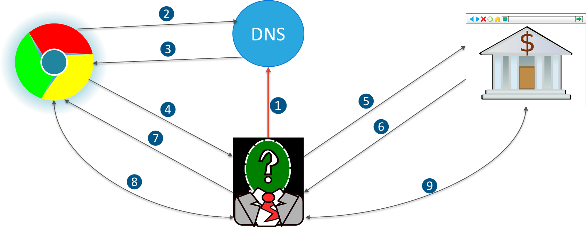
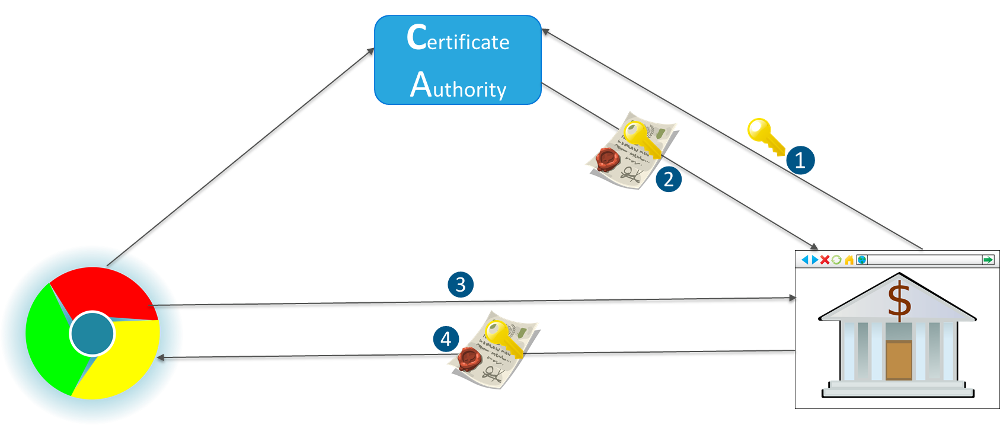
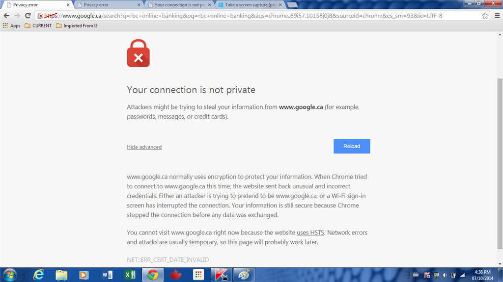

= Motivation for Certificate Authority

Encryption is worthless if not paired with authentication

Take for example the following attack vector:

1. Attacker compromises your DNS and changes to entry for your bank's IP address  to his own IP address
1. You, using the browser, do a DNS request for the IP address of your bank
1. DNS returns the IP address of the attacker
1. You initiate an encrypted channel (request public key ) with the IP you received (that attacker's) assuming it's your bank's website
1. Attacker initiates an encrypted channel with the banks website, using the info it got from you
1. Bank accepts the encrypted channel with the attacker (thinking its you)
1. Attacker accepts the encrypted channel with you
1. You send encrypted banking information to the attacker
1. Attacker relays that information to the bank's website and returns to you the correct data.

You are non the wiser there is man in the middle, as the browser is displaying the correct information

The Solution to the problem is a Certificate Authority (CA) which acts as a trusted third party.

A CA sings the pubic key of the server with metadata to guaratee the encrypted channel is generated with the intended server

A CA chnages the encryption process in the following way. 

Before a server can create an encrypted channel it must first have signed certificate

1. The server first generates a Certificate Signing Request (CSR) which contains a public
   key and metadata about the server including hostname
2. The CA generates a signed certificate which includes the server public key,
   its hostname ( CN ) flags for what the cert can be used for, and the CA signature
3. When a secured connection is attempted the server sends its signed certificate to the connecting browser
4. The browser checks the certificate's signature ensure it has not been tampered with. That means it uses the CA
   public certificate to decrypt the certificate has and enure it matches the certificate
5. The client check the CN matches the host of the URL, and also checks it trusts the CA signing the certificate

If all of check return positive results an encrypted channel is created, if there are any failures

Hence a man in the middle attack can not succeed as the CN will not pass. 

=== Certificate Hierarchy

Certificates have metadata within them:

* metadata state what a certificate can be used for
* Possible use of certificate is signing certificates ( bascally become CA).
* We create a certificate with signing permissions, and use that same certificate to sign itself
** Becomes self signed certificate
** Add the public part of the self signed certificate into truststore
*** becomes a trusted CA
** A CA can create certificates for others allowed to sign certificates.
*** Called intermediate CAs.
** The original certificate is called the root CA.

Certificate authority security:

* very common for root CA to be offline
* only have intermediate CA sign certificates ( to protect root CA)
* intermediate CA not trusted by client
** certificate bundle must be created
** the intermediate CA's certificates must be together with the server's certificate.
** provides lineage to the root CA (which is in the truststore) allowing for the signature to be validated.

 
 

