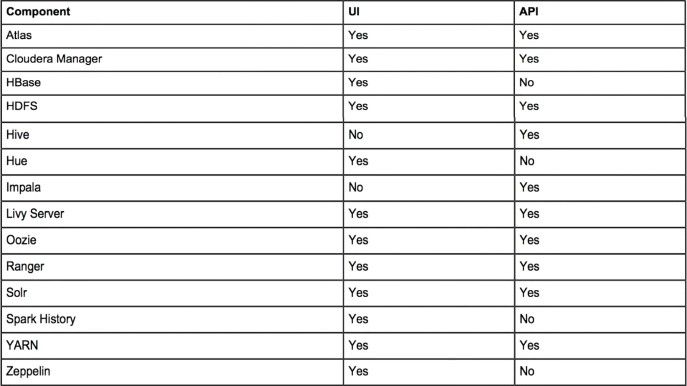
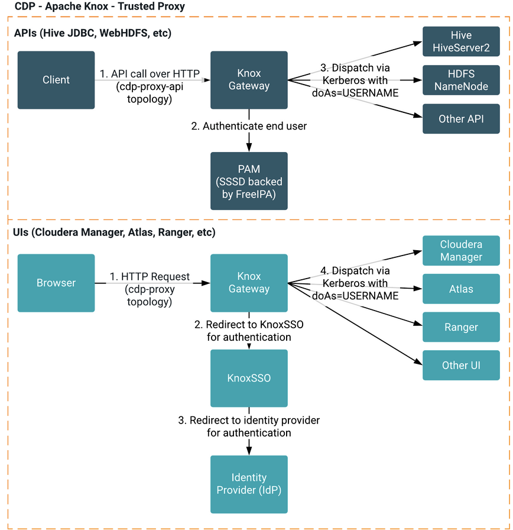

== KNOX

Knox is a central access point into a hadoop cluster.

A partial List of UIs:

* HUE
* Cloudera Manager
* Ranger
* Atlas

Each UI has it's own:

* Authentication system for users
* Hosts and ports for access
* Load balancer setup

KNOX gives a single entry point for everything.

* KNOX integrates with all UIs for authentication
* KNOX gives a central URL for UI access
* KNOX integrates with API endpoints for authentication
* KNOX gives a central URL for API access

List of services supported by KNOX:

Full list available in the link:https://docs.cloudera.com/runtime/7.2.0/knox-authentication/topics/security-knox-supported-services-matrix.html[documentation]

=== Knox integration view

=== KNOX SSO

TODO

== Directory Service

As we mentioned before Kerberos has limitations:

* no implement the concept of groups
* not additional metadata for users allowing for descriptions
* Kerberos can not be used for authentication, only authorization
* Kerberos does not integrate well with a web interface.
** SPNEGO is cumbersome for Linux for example

Solution: Directory Service is a location where:

* Stored credentials for users with additional metedata about each user.
* Metadata can include aliases, group memberships, email addresses etc.
* Object in a Directory are stored in a tree structure, were the leaves are usually the actual users and their credentials
* A single tree in a directory service is called a Domain.
* In Active directory you can have multiple domain in one implementation. This is usually called a forest

A directory Service is typically queried through an LDAP ( Lightweight Directory Access Protocol ) query.

Example using the Ldap search command

ldapsearch -H <ldap_server> -x -D "bind_user" -w "bind_password" -b "search_base" "search"

A typical LDAP search is composed of:

* LDAP URL
* LDAP Bind User and Password
* LDAP Search Base
* LDAP Search Query

[NOTE]
Bind user is a login user for the directory service. Usually without login, you can not query the directory

[NOTE]
The search base is used to subset the search for performance reasons, basically the level of the tree where to
start looking for the interested objects

Sammple LDAP search commands:

ldapsearch -H ldap://ipa1.alexciobanu.ro -x -D "uid=bind,cn=users,cn=accounts,dc=alexciobanu,dc=ro"
-w "bind" -b "cn=users,cn=accounts,dc=alexciobanu,dc=ro" "(uid=admin)"

[NOTE]
LDAP uses polish notation for logical operations hence to search for a user who is a member of group a or group b,
we use the string

ldapsearch -H ldap://ipa1.alexciobanu.ro -x -D "uid=bind,cn=users,cn=accounts,dc=alexciobanu,dc=ro"
-w "bind" -b "cn=users,cn=accounts,dc=alexciobanu,dc=ro" "(&(objectClass=user)(|(memberOf=group_a)(memberOf=group_b)))"

Common implementations of directory services are: OpenLdap, 389 Ldap, Microsoft Active Directory,
Oracle Directory Service etc.

=== Limitations

A directory service does send passwords across the network, hence an encrypted channel (TLS) is required for using
LDAP security. LDAP does not implement a Single Sign On concept.
A user must authenticate each time they perform an action again the Directory server

=== Use ouf LDAP though the product

Legacy Cloudera integrated front end authentication and authorization directly with LDAP

Tools using LDAP with link to integration process:

* Cloudera Manager
** http://www.cloudera.com/documentation/enterprise/latest/topics/cm_sg_external_auth.html
* Hue
** http://www.cloudera.com/documentation/enterprise/latest/topics/cdh_sg_hue_ldap_config.html
* Hive
** http://www.cloudera.com/documentation/enterprise/latest/topics/cdh_sg_hiveserver2_security.html
* Impala
** http://www.cloudera.com/documentation/enterprise/latest/topics/impala_ldap.html#ldap

NOTE: If implementing CDP use KNOX as a authentication gateway and do not integrate directly with LDAP

== Cloudera Usage of Directory Service

Cloudera software requires users and their groups to be available on all servers.

* Can add all users locally on all machines
** Really hard to manage at large scale
** Hard to provision and deposition users in a timely organized manner
* Best solution integrate Linux OS with the Directory service.
** SSSD
** Centrify

If customer has relationship with Centrify follow link:https://docs.centrify.com/en/css/suite2017.1/centrify-cloudera-guide.pdf[this documentation] for integration

Greenfield help deploy SSSD. Customer via RedHat must support their own SSSD.

* Follow link:https://access.redhat.com/documentation/en-us/red_hat_enterprise_linux/7/html/windows_integration_guide/ch-configuring_authentication[redhat documentation]
* Do not use WinBind its known issues when used in a Cloudera cluster

Once integration is done users and groups from Directory Service available at OS level

NOTE: When deploying IPA, SSSD is installed automatically with client deployment

==== Deploy SSSD The easy way.

There is an easier way to deploy SSSD, though it does not work in our circumstance.

* Use realmd when you can
* Need nodes to use the DNS from AD and have the same domain. Makes SSSD much easier
* We can not use it, as our nodes use the domain gce.cloudera.com while AD is adv.sec.cloudera.com.

The process for using realmd is:

1. link:https://access.redhat.com/documentation/en-us/red_hat_enterprise_linux/7/html/windows_integration_guide/realmd-prepreqs[Install realmd] on all nodes in the cluster
1. run the link:https://access.redhat.com/documentation/en-us/red_hat_enterprise_linux/7/html/windows_integration_guide/realmd-domain[discover command] to see if you can reach the AD servers used in the kerberos exercise
1. run the link:https://access.redhat.com/documentation/en-us/red_hat_enterprise_linux/7/html/windows_integration_guide/realmd-domain[join command] to link the host to AD

== Pluggable Authentication Module (PAM)

Linux inbuilt authetication system

* Based on plugin for each authentication service.
* Configuration files in /etc/pam.d/
* Each system has it's own configuration file
** sshd
** su
** sudo
** samba
** etc.
* Separate reusable modules for:
** account modules ( check if it's valid )
** authentication modules ( check password )
** password modules ( for changing password )
** session modules ( login setup )

PAM is like lego.
* Each config could use any module or modules mix and match.
* Same account module used by sshd and su and samba etc.

Cloudera components that can use PAM

* KNOX
* Ranger
* HUE
* Atlas

PAM integration is not very good without SSSD.
* integrate KNOX with PAM though SSSD.
* Great for Directory Service integration with cashing
* No LDAP or TLS needed

