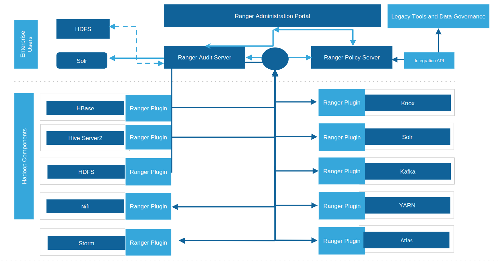

== Authorization

Cloudera's dirty secret ....

Most authorization is group based. This includes HDFS group access for files
and folder and Ranger policy authorization.

How does a distributed system figure out what groups you are a member of?

* org.apache.hadoop.security.ShellBasedUnixGroupsMapping for some service
** Basically goes to OS and runs ( id -Gn <username> )!
* Ranger uses getent at the unix level
* There are other implementations such as direct LDAP though they don't scale

This is another reason SSSD / Centrify is so critical to the deployment

=== Ranger

* Policy based data authorization system.
* Plugin framework for access control

Ranger has 3 different uses:

1. Authorization
1. KMS ( HDFS Encryption )
1. Auditing

Authorization for:

* HDFS
* Hive
* HBase
* YARN
* Kafka
* Solr
* Knox
* NiFi
* Atlas
* Impala

Extensible Architecture

* Custom policy conditions, user context enrichers
* Easy to add new component types for authorization

Architecture:

[ Ranger Architecture ]

=== SQL capabilities

1. Data access restrictions
** Database. Table or Column level
1. Row Filtering
** user characteristics (e.g. group membership) AND
** runtime context
1. Data Making
** policy based dynamic on the fly

Tag Based if integrate with Atlas, more on this in the next section.

* SQL features
** row level filtering
** column masking
** Can be based on user characteristics e.g. group membership
** Can be based on runtime context e.g. time of day

=== Ranger Audits

* Resource Access Events with user context
* Policy Edits/Creation/Deletion
* User session information
* Component plugin policy sync operations

=== Advanced Features

Some advanced features of Ranger that can be used for complex use cases

* Policy Prioritization
** Override deny-policy to allow access for a user temporarily
** Override data mask or row-filter for a user of a group
** Great in break glass scenarios
* Hive UDF Authorization
** Several partner tools (MF Voltage, Protegrity ) use custom UDFs for special operations such as decrypting encryptedd columns
** Authorization for such functions can be centralized and audits generated for any permanent UDFs

=== Hive Warehouse Connector

* Shared Access Control Policy between SparkSQL and Hive Audit
* All access via SparkSQL audited & searchable through Ranger
* Each user can use a unique queue while accessing the securely shared data
* Minimum Transition Cost Since this feature offers row/ column level security
* Spark apps and scripts and all Spark shells (spark-shell, pyspark, sparkR, spark-sql) are supported
* Required for Spark access to Hive managed tables ( ACID tables )
** Do not use for external tables
* Currently in beta, keep your eyes open for GA date

== HDFS Permission

* If not using Ranger, HDFS have standard linux like permissions. link:http://hadoop.apache.org/docs/r2.6.0/hadoop-project-dist/hadoop-hdfs/HdfsPermissionsGuide.html[HDFS Permissions]

* HDFS permissions are mostly POSIX
** Remember that `hdfs` is the HDFS superuser, not `root`
** Execution bit on directories is a sticky bit

* link:http://hadoop.apache.org/docs/r2.6.0/hadoop-project-dist/hadoop-hdfs/HdfsPermissionsGuide.html#ACLs_Access_Control_Lists[POSIX-style ACLs are supported]
** But disabled by default (`dfs.namenode.acls.enabled`)
** You can add permissions for users, groups, other, and apply a default _mask_
*** `chmod` operates on mask to calculate effective permissions
** ACLs are best used to refine -- not replace -- file permissions
*** There is a measurable cost to storing and processing them
