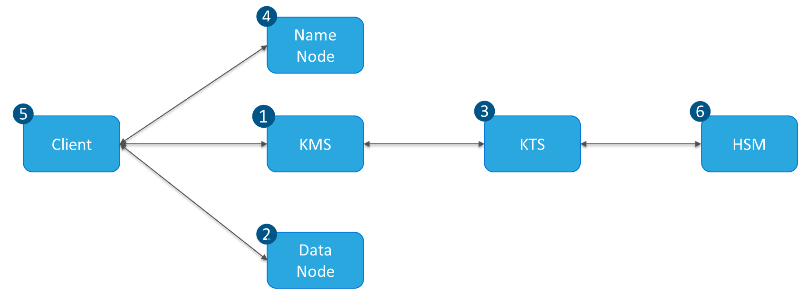
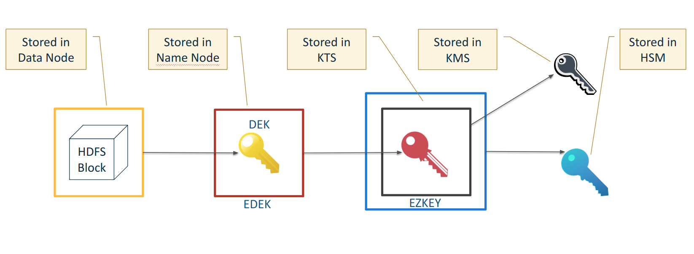

== Data At Rest Encryption

Back in 2013 Intel and Cloudera launched project Rhino, and initiative to bring data security to the Hadoop platform.

One of the results of the project was HDFS Transparent Data Encryption (TDE).

TDE was part of the HDFS project inducting a new component called HDFS KMS gateway. More details on on the Apache site:

https://hadoop.apache.org/docs/current/hadoop-project-dist/hadoop-hdfs/TransparentEncryption.html

KMS gateway create an interface for HDFS to encrypt data though, it did not provide a secure way to secure master keys.

Cloudera bought Gazzang, a company which developed key management software, which was rebranded as
Cloudera Key Trustee Server.

KMS + KTS = TDE

=== How TDE works

 
1. The Key Trustee Server (KMS) generates a file encryption key
1. A data block which is encrypted with the file key is stored in the name node
1. That file key is encrypted with the zone key which is kept in the Key Trustee Server (KTS)
1. The encrypted file key is stored in the Name Node metadata, along with the other details about the file
1. The client makes requests to retrieve an unencrypted version
   of the file key for encryption and decryption of the data block
1. [Optional] The Zone key can be itself encrypted by a HSM (Hardware storage module)
   key ... for extra protection of the HSM key
 
To better understand the way the keys work we can look at the following image:

1. The HDFS block is encrypted with the DEK ( Decryption Encryption key )
1. The DEK is encrypted with the zone key and it that becomes the EDEK ( Encrypted Decryption Encryption key )
1. The Zone key is encrpyted with the KMS private key, and it becomes the EZK ( encrypted zone key ).
   It is stored in the KTS ( Key Trustee Store )
  
Components of TDE:

* Key Trustee Server (KTS):
**  Stores all of the Zone keys. Deployed on a separate 2 node cluster with a special parcel downloadable from the
 Cloudera website ( requires login )
* Key Management Server (KMS):
**  Interface layer between KTS and the rest of the cluster.
   This is the only place a EDEK can be decrypted, and the DEK is only sent to the client,
   hence no cluster component has access the unencrypted data ( without client authorization )
   
=== Navigator Encrypt

Back to Gazzang. What did Gazzang do with they key store. They used it as a key store for encrypting arbitrary linux
locations.
* Augments Linux dm-crypt
* Historically worked with ecryptfs though that is deprecated.

What did with this functionality ... that's right rebrand. Now its called Navigator Encrypt.

Useful for encrypting "data" stored on other technologies than HDFS. Technologies like
* Kudu
* Kafka
* Edge Node landing zones

=== Using TDE

* hadoop key create <keyname>
** When configured, requires permission from KMS
** Does nothing without a key provider available
* hdfs crypto -listZones
** Try this too
* hdfs crypto –createZone –keyName <keyname> -path /zone
** HDFS privileges required
** (And of course you don’t have a zone key yet)

=== KMS ACLS

KMS specifies its own authorization scheme

* Separates key administration from Hadoop operations
* Non-admin users have no default access to encrypted data

The ACLs cover two categories of operation
* KMS services
* Key access

There are five classes documented upstream:

* KMS operations
* KMS operations blacklist
* Access to a named key
* Access to unnamed keys (“default” ACLs)

Key operations whitelist

* Each permission is defined by a whitelist, an operation, and a blacklist
* Allows control at three decision points
* You can permit users to make KMS requests
* You can permit an operation for users across all keys (default)
* You can permit an operation for users on a named key
* You can deny users one or more operations

==== ACL Descriptions

hadoop.kms.acl.<op>

* Authorizes a KMS service operation

hadoop.kms.blacklist.<op>

* Disallows access to KMS service operations

key.acl.<key-name>.<op>

* Authorizes an operation on a named key

default.key.acl.<op>

* Authorizes an operation on all unnamed keys

whitelist.key.acl.<op>

* Authorizes an operation across all keys.

==== Using DistCP

The client will need permission to decrypt keys

* If copying data from plain HDFS to an EZ:

File attributes & checksums will differ between source and target

* Use –update –skipcrccheck

If you start distCp above an EZ directory

* The target creates an EZ at the same directory level
* Creating parallel EZs first will prevent this
* Raw, encrypted block data are stored in /.reserved/raw
* Includes the extended attributes (xattr) mentioned earlier
* HDFS superuser privilege is required

